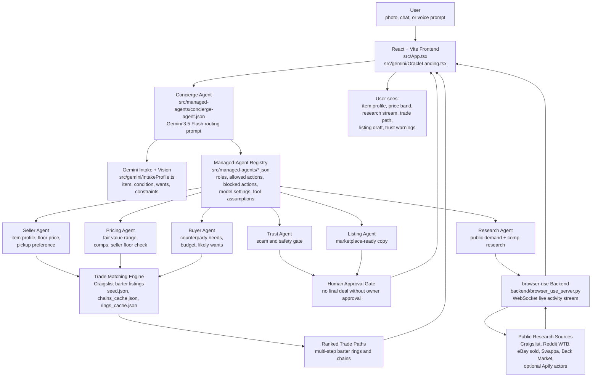

# The Oracle

The Oracle is a managed-agent barter platform built for the Google I/O Hackathon 2026. It helps people turn something they already own into something they actually want by coordinating Gemini-powered agents around real secondhand-market data and Bay Area Craigslist barter listings.

## Problem Statement

People often have valuable items sitting unused, while the things they want are locked behind cash prices, fragmented marketplaces, and one-to-one barter matches that almost never line up. Barter should be powerful, but in practice it is too hard to price items, find compatible counterparties, avoid scams, and discover multi-step trade paths where everyone receives something useful.

In an ideal world, a person could upload a photo or describe an item, state what they want, and let an intelligent agent network search, price, reason, and protect the transaction without taking away human control. Our vision for The Oracle is to become the trusted agent layer for secondhand exchange: a system that can understand messy listings, coordinate safe trade paths, and make no-cash commerce feel as direct as buying from a normal marketplace.

The MVP proves the core loop with real Bay Area Craigslist barter data. A user can upload a photo or chat with the Concierge Agent, Gemini extracts item and intent, managed agents price and research the item, the app searches messy listing pools, and The Oracle reveals realistic multi-step trade paths where everyone gets something useful without money changing hands.

## What It Does

- Accepts a photo, chat message, or voice prompt about something the user wants to trade or sell.
- Uses Gemini vision and chat to identify the item, normalize details, and collect trade constraints.
- Routes the workflow through a managed-agent architecture with a Concierge Agent and six specialist agents.
- Searches and reasons over Bay Area Craigslist barter listings, cached open chains, and closed trade rings.
- Runs a live Research Agent path that streams browser activity into the UI.
- Estimates fair value ranges and likely buyer demand signals.
- Drafts marketplace-ready listing language from verified facts.
- Blocks unsafe actions with Trust Agent guardrails.
- Keeps the human owner in control of every final action.

## Managed-Agent Architecture

Yes. The Oracle uses a managed-agent architecture to power the barter workflow.

The app starts with a **Concierge Agent**, which acts as the front door. A user can upload a photo or describe something they want to trade, and the Concierge figures out what they have, what they want, and which specialist agents should help.

Each managed agent is defined in [`src/managed-agents/*.json`](src/managed-agents) with its own role, purpose, allowed actions, blocked actions, model settings, and tool assumptions. This keeps the system controlled instead of letting one large agent make every decision.

The MVP expresses these agents as declarative managed-agent contracts in the repo and powers them with Gemini 3.5 Flash, Gemini streaming calls, and a browser-use research backend. The same contract shape is designed to map cleanly to Gemini Managed Agents / Interactions API style execution, where Google-managed runtime services can handle orchestration, state, tool execution, background tasks, and sandboxing.

## Agent Registry

| Agent | File | Role | Primary Responsibility |
| --- | --- | --- | --- |
| Concierge Agent | [`src/managed-agents/concierge-agent.json`](src/managed-agents/concierge-agent.json) | `concierge` | Front door, intent detection, routing, user explanation, approval gates. |
| Seller Agent | [`src/managed-agents/seller-agent.json`](src/managed-agents/seller-agent.json) | `seller` | Understands what the user is offering, including item details, condition, location, pickup preferences, and minimum acceptable value. |
| Pricing Agent | [`src/managed-agents/pricing-agent.json`](src/managed-agents/pricing-agent.json) | `pricing` | Estimates a fair value range so the trade path feels realistic and balanced. |
| Research Agent | [`src/managed-agents/research-agent.json`](src/managed-agents/research-agent.json) | `research` | Searches public sources like Craigslist, Reddit WTB posts, Swappa, eBay, Back Market, and optional Apify actors to find pricing, demand, and possible trade signals. |
| Buyer Agent | [`src/managed-agents/buyer-agent.json`](src/managed-agents/buyer-agent.json) | `buyer` | Models what people on the other side of a listing might realistically want in return. |
| Listing Agent | [`src/managed-agents/listing-agent.json`](src/managed-agents/listing-agent.json) | `listing` | Turns the user's item and trade intent into clear marketplace-ready language. |
| Trust Agent | [`src/managed-agents/trust-agent.json`](src/managed-agents/trust-agent.json) | `trust` | Blocks scams, unsafe payment behavior, private contact sharing, and any attempt to finalize a deal without human approval. |

## Architecture Diagram



## How Managed Agents Are Used

The Oracle does not let one general-purpose prompt handle the entire barter workflow. Instead, the Concierge Agent loads the managed-agent descriptors and routes work to specialized agents whose behavior is constrained by their JSON contracts.

The **Seller Agent** reads the item profile and protects the owner's minimum acceptable value. The **Pricing Agent** normalizes comps and produces list, fair, and fast-sale price bands. The **Research Agent** is the most live agent because it streams browser-use activity into the UI, showing which public sites it visits and what signals it finds. The **Buyer Agent** models counterparty demand and likely acceptance. The **Listing Agent** turns verified facts into marketplace-ready copy. The **Trust Agent** reviews messages and deal steps for unsafe behavior before anything reaches the owner.

For the MVP, these agents work together around real Bay Area Craigslist barter listings. The Concierge uses Gemini to understand the item, call the right agents, search the messy listing pool, and help reveal a specific multi-step trade path where everyone gets something useful without money changing hands.

## Guardrails

All agents follow strict marketplace safety rules:

- No logins.
- No posting.
- No DMs or private messages.
- No checkout.
- No payments.
- No captcha bypass.
- No scraping private contact information.
- No sharing home addresses or private contact details.
- No pretending an AI agent is human.
- No final action without explicit human approval.

The Trust Agent is the final safety layer. It blocks scam patterns such as payment-code requests, shipping pivots on local-only listings, off-platform urgency, fake identity pressure, and attempts to bypass owner approval.

## Data Sources

The MVP includes local and live data surfaces:

- `seed.json`: structured Bay Area Craigslist barter listings.
- `chains_cache.json`: precomputed open trade chains that need one missing participant.
- `rings_cache.json`: precomputed closed trade rings where every member receives a specific want.
- Public research pages through browser-use: Craigslist wanted posts, Reddit WTB searches, Craigslist for-sale comps, eBay sold listings, Swappa, and Back Market.
- Optional Apify actors for Facebook Marketplace and OfferUp when `APIFY_TOKEN` is configured.

## Core User Flow

1. The user opens The Oracle and uploads a photo, types a description, or uses voice.
2. The Concierge Agent identifies the item and asks for missing details when needed.
3. The Seller Agent builds an item profile with condition, location, pickup preferences, and seller floor.
4. The Pricing Agent estimates a defensible value range.
5. The Research Agent searches public buyer-demand and resale signals, streaming browser activity into the UI.
6. The Buyer Agent models realistic counterparty wants and deal fit.
7. The trade matcher searches listings, open chains, and closed rings for viable barter paths.
8. The Listing Agent drafts publishable marketplace language from verified facts.
9. The Trust Agent blocks unsafe deal patterns and forces human approval.
10. The user sees a proposed trade path, price logic, listing language, and safety notes.

## Tech Stack

- React 19
- TypeScript
- Vite
- Tailwind CSS v4
- Lucide React icons
- Gemini 3.5 Flash for chat, vision, routing, structured reasoning, and streaming responses
- JSON managed-agent descriptors in `src/managed-agents`
- Python FastAPI browser-use backend for live public research
- Playwright / Chromium through browser-use
- Optional Apify actor integrations

## Repository Structure

```text
.
├── backend/
│   ├── browser_use_server.py      # Live browser-use WebSocket research backend
│   ├── requirements.txt           # Python backend dependencies
│   └── README.md                  # Backend-specific setup and protocol
├── src/
│   ├── browser/                   # Browser stream client and viewport UI
│   ├── gemini/                    # Concierge chat, Gemini client, intake, voice, strategy
│   ├── managed-agents/            # Managed-agent JSON contracts and Research Agent helper
│   ├── App.tsx                    # Main dashboard/demo flow
│   ├── App.css
│   ├── index.css
│   └── main.tsx
├── seed.json                      # Structured Craigslist barter listings
├── chains_cache.json              # Open chains for ring completion
├── rings_cache.json               # Closed barter rings
├── .env.example                   # Environment variable template
├── package.json                   # Frontend scripts and dependencies
└── README.md
```

## Environment Variables

Copy `.env.example` to `.env` and fill in the values you need.

| Variable | Required | Purpose |
| --- | --- | --- |
| `VITE_GEMINI_API_KEY` | Yes for local Gemini calls | Frontend Gemini streaming, intake, and live Research Agent helper. |
| `GEMINI_API_KEY` | Yes for backend research | Python browser-use backend and server-side Gemini calls. |
| `VITE_BROWSER_USE_WS_URL` | Optional | WebSocket URL for the live browser research backend. Defaults to `ws://localhost:8765/ws/research`. |
| `APIFY_TOKEN` | Optional | Enables Apify actor fallbacks for Facebook Marketplace and OfferUp. |
| `APIFY_FACEBOOK_MARKETPLACE_ACTOR_ID` | Optional | Override the Facebook Marketplace actor. |
| `APIFY_OFFERUP_ACTOR_ID` | Optional | Override the OfferUp actor. |
| `OPENAI_API_KEY` | Optional | Voice fallback / realtime voice support in the Vite dev proxy. |
| `ELEVENLABS_API_KEY` | Optional | Primary voice synthesis support. |
| `ELEVENLABS_VOICE_ID` | Optional | ElevenLabs voice selection. |

## Run Locally

Install frontend dependencies:

```bash
npm install
```

Start the Vite dev server:

```bash
npm run dev
```

Open the local URL printed by Vite.

## Run The Live Research Backend

The live Research Agent uses a Python backend to drive Chromium and stream activity to the React UI.

```bash
cd backend
python3 -m venv .venv
source .venv/bin/activate
pip install -r requirements.txt
playwright install chromium
set -a; source ../.env; set +a
uvicorn browser_use_server:app --port 8765 --host 0.0.0.0
```

For visible browser debugging:

```bash
HEADLESS=0 uvicorn browser_use_server:app --port 8765 --host 0.0.0.0
```

## Available Scripts

| Command | Description |
| --- | --- |
| `npm run dev` | Start the Vite development server. |
| `npm run build` | Type-check and build production assets. |
| `npm run lint` | Run ESLint. |
| `npm run preview` | Preview the built Vite app. |

## MVP Scope

The current MVP is intentionally focused:

- Bay Area Craigslist barter listings.
- A photo/chat/voice front door.
- Gemini-powered item understanding and agent routing.
- Managed-agent descriptors for controlled specialist behavior.
- Live public research streaming for marketplace demand.
- Trade path discovery across cached listings, open chains, and closed rings.
- Safety-first guardrails and explicit human approval.

It does not autonomously post listings, message buyers, accept payment, log into marketplaces, bypass captchas, or finalize trades.

## Future Work

- Deploy the agent contracts onto Gemini Managed Agents / Interactions API runtime for server-side state, background tasks, and managed tool orchestration.
- Add persistent user profiles and item inventories.
- Expand beyond Craigslist barter into Facebook Marketplace, OfferUp, Swappa, eBay, Reddit communities, and local mutual-aid groups.
- Add a graph database for trade-chain search and confidence scoring.
- Add explicit user consent flows for any marketplace posting integrations.
- Add agent observability: trace logs, tool-call timelines, safety decisions, and replayable deal histories.
- Add verification workflows for serial numbers, receipts, condition photos, and pickup handoff checklists.

## Hackathon Context

Built at the Google I/O Hackathon 2026 in Cerebral Valley with a focus on Gemini-powered agent workflows, managed-agent orchestration, and practical secondhand-market safety.
